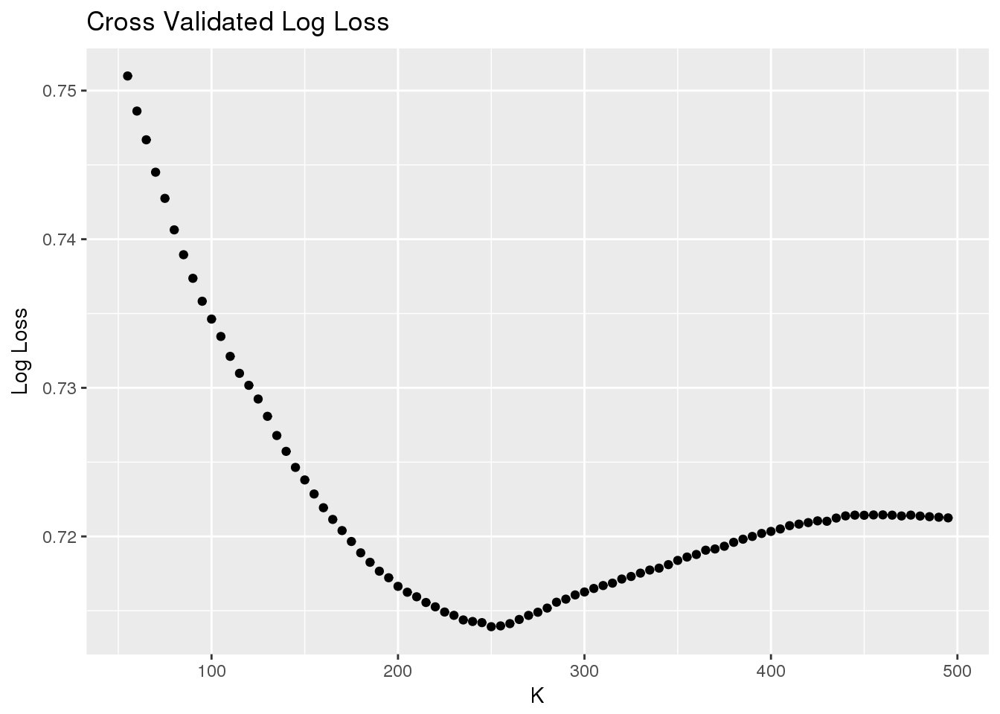

```{r setup, include=FALSE}
knitr::opts_chunk$set(echo = TRUE)
library(rpart)
library(rpart.plot)
library(class)
library(MLmetrics)
library(tidyr)
library(dplyr)
library(grid)
library(jpeg)
library(rjson)
library(RCurl)
library(caret)
library(densityvis)
library(ggplot2)
library(glmnet)
```

#Introduction

Kobe Bryant is considered by many to be the one of the greatest basketball players of all-time. In his 20 year NBA career, Bryant won five NBA Championships, was selected to 18 All-Star Games, and took 30,697 field goal attempts, or shots. For our project, we decided to participate in the Kobe Bryant Shot Selection Kaggle competition: https://www.kaggle.com/c/kobe-bryant-shot-selection

The task here is to use a training set of Kobe Bryant shot attempts to predict whether or not a shot will go in on a test set of 5000 shots Bryant took in his career. In this project, we examine the ability of three different strategies to predict shot success on the test set: K-NN, Logistic Regression, and CART. 


#Data

The training set contains 25,697 shot attempts with 24 potential predictor variables. The response variable, shot_made_flag, is the binary classification of whether or not Bryant made the shot. The predictor variables include identifiers like the game_date, opponent, game_date, and shot_id, none of which are useful in predicting whether or not Bryant made a shot. Having said that, predictors like shot distance, shot location, and shot_type are more useful in predicting shot success, which is why our analysis focused on these variables that are specific to a given shot. The test set contained the same potential predictor variables with only 5000 observations. 

#Exploratory Analysis


```{r, include=FALSE}
shots<-read.csv("data.csv") #read in data
test<-subset(shots, is.na(shot_made_flag))
train<-subset(shots, !is.na(shot_made_flag))

# convert all characters to factors in train and test set
train <- train %>%
  mutate(season = as.factor(season),
         shot_type = as.factor(shot_type),
         shot_zone_area = as.factor(shot_zone_area),
         shot_zone_basic = as.factor(shot_zone_basic),
         shot_zone_range = as.factor(shot_zone_range),
         team_name = as.factor(team_name),
         matchup = as.factor(matchup),
         opponent = as.factor(opponent))

test <- test %>%
  mutate(season = as.factor(season),
         shot_type = as.factor(shot_type),
         shot_zone_area = as.factor(shot_zone_area),
         shot_zone_basic = as.factor(shot_zone_basic),
         shot_zone_range = as.factor(shot_zone_range),
         team_name = as.factor(team_name),
         matchup = as.factor(matchup),
         opponent = as.factor(opponent))
```


Before creating models, we explored the dataset, examining potential variables to be included in each model. The below graph has broken the basketball court into various regions, and the shot accuracy for each region is indicated by the color. The size of the points corresponds to the volume of shots in a given region.


```{r, echo=FALSE}
courtImg.URL <- "https://thedatagame.files.wordpress.com/2016/03/nba_court.jpg"
court <- rasterGrob(readJPEG(getURLContent(courtImg.URL)),
           width=unit(1,"npc"), height=unit(1,"npc"))

train2<-train
closest<-hex_pos(train2$loc_x, train2$loc_y, 70,70) #create bins
train2$center_x=closest[,1] 
train2$center_y=closest[,2]

train2<-subset(train2, center_y<350 & abs(center_x)<250) #ignore backcourt shots. they are outliers

train3<-train2 %>%
  group_by(center_x, center_y) %>%
  summarise(makes=sum(shot_made_flag), tot=n()) %>%
  mutate(Accuracy=100*makes/tot) #get accuracy for each hexagon


ggplot(train3, aes(center_x,center_y, color=Accuracy)) + #create plot
  annotation_custom(court, -250, 250, -52, 418) +
  geom_point(aes(size=tot)) + 
  scale_color_gradient(low="blue", high="red") + 
  guides(alpha = FALSE, size = FALSE) +
  xlim(250, -250) +
  ylim(-52, 418) +
  xlab("") + ylab("") + ggtitle("Kobe Bryant Shot Accuracy")
```


Notice in the above plot that the largest point is by far the one directly underneath the basket. Kobe Bryant made a career out of getting to the basket, and when he got there, he rarely missed. As expected, the points tend to turn blue and dark purple the further from the basket we move. Bryant's efficiency, as expected, decreased, as he moved towards the three point arc and beyond. Outside the point closest to the hoop, Bryant's high volume regions tend to be on the wings, both in the mid range and at the three point arc. It is clear that both location and distance play a role in the likelihood a shot is made. Having said that, obviously the two variables are not completely independent of one another, so the inclusion of both in our models may or may not be necessary.

Various categorical variables in this dataset are simply imprecise versions of distance. The categorical variable "combined_shot_type" has levels like "Jump Shot", "Dunk", and "Layup"; naturally, jump shots will be further from the basket than layups and dunks. If we know distance, then we likely know shot type as well; Bryant will not be taking layups 30 feet from the basket. Having said that, the reverse applies. If we know shot type, then we likely do not need to know distance. In our models, it became clear that it was necessary to only include one of these variables. Notice below the differences in shot accuracy given the shot type; Bryant is most succesfuly on dunks and bank shots.

```{r}
prop.table(table(train$combined_shot_type, train$shot_made_flag),1) -> temp
as.data.frame.matrix(temp) -> temp
temp$shot <- rownames(temp)
ggplot(temp, aes(x = reorder(shot, `1`), y = 1)) +
geom_point(aes(y = `1`), size = 3, color = " dark blue", stat = "identity") +
    coord_flip() +
    labs(y = "Accuracy", x = "", title = "Accuracy by Shot Type")
```


The code below examines trends in efficiency both by the season in which Bryant played, and whether or not the shot occured in the playoffs.

```{r}
by_season<-train2 %>%
  group_by(season) %>%
  summarise(fg_pct=mean(shot_made_flag), count=n()) %>%
  mutate(season=strtrim(season,4))

ggplot(by_season, aes(season, fg_pct)) + geom_col() + ggtitle("Accuracy by Season") +
  xlab("Season") + ylab("FG %")

playoffs<-train2 %>%
  group_by(playoffs) %>%
  summarise(fg_pct=round(100*mean(shot_made_flag),2), count=n())
colnames(playoffs)<-c("Playoffs", "FG Percentage", "Shots")

knitr::kable(playoffs)
```

Notice in the graph of Bryant's accuracy by season, there are two peaks, each representing the "double primed" career Bryant enjoyed. It is no coincidence that some of Bryant's best seasons from an accuracy perspective came when he won NBA championships (2000, 2001, 2002, 2008, 2009). While the differences in accuracy may seem small on the graph, there is clearly a season effect here, as a few percentage points amounts to a lot of shots over the course of a given season.

Kobe Bryant is certainly known for his playoff performances, as he had led 5 Laker teams to NBA titles. While the sample size in the playoffs is much smaller, 3724 field goal attempts in the playoffs is a sufficiently large sample size; notice there is a negligible difference in Bryant's field goal percentage in the playoffs. It likely does not help us to include this predictor in the K-NN algorithm.

Notice below there seems to be a slight period effect. Look at the dip Bryant sees in the 4th quarter. The sample size is much too low in the 5th, 6th, and 7th quarters to make much of them, but period might be a variable of interest.

```{r}
by_period<-train2 %>%
  group_by(period) %>%
  summarise(fg_pct=mean(shot_made_flag), count=n())

ggplot(by_period, aes(period, fg_pct)) + geom_col() + ggtitle("Period Effect?") +
  xlab("Period") + ylab("FG %")
```

After exploring the dataset and examining the relationships between potential predictors and shot success, we created 3 different models, analyzing the strengths and weaknesses of each. 

#K-NN

The primary ways in which we could influence the performance of the K-NN model are with our choice of K and with our choice of a predictors.

In our analysis of potential predictors, we quickly removed categorical variables from consideration, since creating a distance metric for categorical variables is difficult when the categorical variables are not ordinal. While it is possible to create a numerical value for each categorical variable, doing so would at a degree of variability and subjectivity to the model that is unneccessary. Given that "combined_shot_type" and other categorical variables can be accounted for with distance and the raw x and y coordinates of each shot, we have elected not to create any distance metrics for the categorical variables. As shown above, there is a season and period effect, and we included them because they are ordinal variables, allowing for clear distance measurements.

Finally, we settled on the x and y locations of the shots, distance, period, and the season as our predictor variables. In an effort to create more precision and reduce the likelihood of ties, we chose the "lat" and "lon" columns to determine the location of the shot, as they contained more significant figures. Season and period are ordinal variables, which allow for us to easily measure distance, making them clear additions to the model. After creating a predictor matrix, we used cross-validation to select an optimal K value. 


Below, we have completed a 10 fold cross-validation process for $k=1,5, 10, 15, ..., 495$ in order to optimize our choice for k. Since Kaggle uses Log-Loss as its measure of model performance, we have done the same in the cross-validation process. After initially creating a vector of k-vals, shown below, we realized that with such a large sample size, $k$ would have to be very large in order for the Log-Loss to reach a minimum. We found that the Log-Loss reaches a minimum around $k=250$.


```{r}
 LogLossBinary = function(actual, predicted, eps = 1e-15) {
  predicted = pmin(pmax(predicted, eps), 1-eps)
  - (sum(actual * log(predicted) + (1 - actual) * log(1 - predicted))) / length(actual)
} #https://www.r-bloggers.com/making-sense-of-logarithmic-loss/
```


```{r, eval=FALSE}
set.seed(3)
k_vals=rep(0,99)
k=5

train<-sample_n(train, .1*dim(train)[1])
for (i in 1:length(k_vals)){
  k_vals[i]=k
  k=k+5
}
y=train$shot_made_flag
x <- train[, c(5, 8, 10, 12)] %>%
  mutate(season=strtrim(season, 4)) %>%
  mutate(season=as.numeric(season))

  
idx<-createFolds(y, k=10)
errors_for_k=rep(0, length(k_vals))
for (j in 1:length(k_vals)){
  errors<-rep(0, 10)
for (i in 1:10) {
  psuedo_train=x[ -idx[[i]] , ]
  psuedo_test=x[ idx[[i]], ]
  outcomes<-y[ -idx[[i]] ]
  pred <- attr(class::knn(train=psuedo_train, test=psuedo_test, cl=outcomes, k=k_vals[j], prob=TRUE), "prob")
   errors[i]=LogLossBinary(y[idx[[i]]], pred)
}
  errors_for_k[j]=mean(errors)
}

cross<-data.frame(k=k_vals, cv_mse=errors_for_k)

ggplot(filter(cross, k>50), aes(k, cv_mse))+geom_point() + ggtitle("Cross Validated Log Loss") +
  xlab("K") + ylab("Log Loss")

```




The large requirement for $k$ makes sense, given the size of our training set is nearly 26,000 observations. Below, we use $k=250$ to predict shot outcomes on the test set.

```{r}
x <- train[, c(5, 8, 10, 12, 14)] %>%
  mutate(season=strtrim(season, 4)) %>%
  mutate(season=as.numeric(season))
outcomes<-train[,c(15)]
y <- test[, c(5, 8, 10, 12, 14)] %>%
  mutate(season=strtrim(season, 4)) %>%
  mutate(season=as.numeric(season))

pred <- class::knn(train=x, test=y, cl=as.factor(outcomes), k=250, prob=TRUE)
test$pred=attr(pred, "prob")
```

##Submission For K-NN

```{r}
sub<-test[,c(25, 26)]
colnames(sub)[2]="shot_made_flag"
write.csv(sub, "Knn_sub.csv", row.names=FALSE)
```


Our log-loss from Kaggle was 0.74653, which is actually lower than our cross-validated log-loss of 0.74844 with $k=250$. While not stellar compared to Kaggle's top score of 0.56528, K-NN performed rather well in predicting the outcome of Kobe Bryant's shots on an out-of-sample set.


#Logistic Regression

```{r}
# Wrapper Function
get_LASSO_coefficients <- function(LASSO_fit){
  coeff_values <- LASSO_fit %>% 
    broom::tidy() %>% 
    as_tibble() %>% 
    select(-c(step, dev.ratio)) %>% 
    tidyr::complete(lambda, nesting(term), fill = list(estimate = 0)) %>% 
    arrange(desc(lambda)) %>% 
    select(term, estimate, lambda)
  return(coeff_values)
}
```

We will use the wrapper function when we look at plots of the coefficients. 


```{r} 
model_formula <- as.formula(shot_made_flag ~ combined_shot_type + lat + lon + minutes_remaining + period + playoffs + season + shot_distance + opponent)
```


Luckily, shot location and shot distance accounts for many of the categorical variables included in the training set. From the shot location, it is clear whether the shot was a 2PT field goal or a 3PT field goal or what shot_zone_area the shot fell into. As a result the only categorical variable we elected to include was combined_shot_type, which provides useful information as to the difficulty of the shot. In order to remain consistent with our model for K-NN, we elected to use the lat and lon columns for the shot location. While we did not see a playoffs effect in our exploratory analysis, we conducted a logistic regression with L1 regularization, meaning that predictors that aren't useful will have coefficients of 0. 


```{r}
# Predictor Matrix for Training Set
predictor_matrix_train <- model.matrix(model_formula, data = train)[, -1]

# dummy filler so that we can create the test predictor matrix
test$shot_made_flag <- rep(c(1,0)) 

# Predictor Matrix for the Test Set
predictor_matrix_test <- model.matrix(model_formula, data = test)[,-1]
```

It is important to note that in the test set `shot_made_flag` only had one level because it was a vector of all NA's since this information was not provided and is what we are trying to predict. With that being said we ran into a similar error for the test set's `shot_made_flag` as we did for `team_name` and `team_id`, so we assigned alternating 1's and 0's to this data so that we can run the predictor matrix, but the prector matrix does not include `shot_made_flag`, so ultimately this does not create an issue for the rest of the process.


#### First Attempt to Fit Model
```{r}
# Define values of tuning/complexity parameter lambda
lambda_inputs <- 10^seq(-2, 0, length = 100)
# lambda inputs range from 10^-2 to 10^0

# Fitting the Model
LASSO_fit <- glmnet(x=predictor_matrix_train, y=train$shot_made_flag, alpha = 1, 
                    lambda = lambda_inputs, family = "binomial") 
# use family = "binomial" for logistic regression

# Get beta-hat coefficients for ALL values of knob/tuning parameter lambda
LASSO_coefficients <- get_LASSO_coefficients(LASSO_fit)

# Coefficient Analysis Plot
plot_LASSO_coefficients <- LASSO_coefficients %>% 
  mutate(lambda=exp(lambda)) %>%
  filter(term != "(Intercept)") %>% 
  ggplot(aes(x=lambda, y=estimate, col=term)) +
  geom_line() +
  #scale_x_log10() +
  labs(x="lambda (log10-scale)", y="beta-hat coefficient estimate",
       title="LASSO regularized coefficient for each lambda value") 

```

We set the values for lambda and fit an initial model based on this tuning parameter. In the plot above, the x-axis is on a log10 scale so that we can more easily see the values of lambda on the x-axis. The plot illustrates each setting of lambda on the x-axis log10 scale with the beta_hat coefficient estimate on the y-axis. We are most interested with where the beta_hats equal zero. The coefficients which last drop to zero will contribute most to the model. Before we look further into our ideal predictors we will use cross-validation to further improve our model.

#### Fitting the Model with Crossvalidation
```{r}
# Model fit with crossvalidation
LASSO_CV <- cv.glmnet(x=predictor_matrix_train, y=train$shot_made_flag, alpha=1, lambda=lambda_inputs, family = "binomial") 


# Optimal lambdas
lambda_star <- LASSO_CV$lambda.min
lambda_star_1SE <- LASSO_CV$lambda.1se

plot_LASSO_coefficients2 <- plot_LASSO_coefficients +
  #coord_cartesian(xlim=c(,), ylim=c(-.3, .3)) +
  geom_vline(xintercept = lambda_star, col="red", alpha=0.4, linetype="dashed") +
  geom_vline(xintercept = lambda_star_1SE, col="blue", alpha=0.4, linetype="dashed")
<<<<<<< HEAD
plot_LASSO_coefficients +
  coord_cartesian(ylim=c(-0.5, 0.5))
=======
plot_LASSO_coefficients2
>>>>>>> f8073e80d8cd7e9202ad0be7b17bf708ca092a63

```

We use cross validation to obtain the lambda_star for lambda which yield beta_hats associated with the lowest MSE values. However in an effort to preserve model simplicity we will want to use the beta_hats associated with MSE values which are at most one standard error away from the minimum MSE as higher values of lamba penalize model "complexity". In other words, as we move from left to right on the x-axis, the lambda values go up and model "complexity" decreases. When looking at the plot, the red dashed line refers to the minimum MSE, the point at which our model is optimized. The blue line refers to the point at which the model outputs a "score" which is one standard error away from the minimum MSE. As supported by the plot illustrating the optimal lambda values there are about 4 variables which make a significant contribution to the model. The variables are as follows in order of most informative to least informative:

*combined_shot_type Dunk*, *combined_shot_type Jump Shot*, and *shot_distance* 

Thus suggesting a model that might look like the following:


Below, we have calculated he Log-Loss using our optimal lambda on our training set. 

```{r}
log_odds_hat <- predict(LASSO_CV, newx=predictor_matrix_train, s=lambda_star_1SE) %>% 
  as.vector()

p_hat <- 1/(1 + exp(-log_odds_hat))

train <- mutate(train, p_hat = p_hat)


# Log-loss for predicted on train
LogLossBinary(train$shot_made_flag, train$p_hat)

```


We have this value now as a baseline so that we can determine if we have significantly overfit to our training data. If our Kaggle score is significantly worse than the figure above, then it is likely we have overfit to our training set. Having said that, with both the use of regularization and by using `lambda.1se` to simplify our model, we feel that we took proper precautions to reduce the likelihood of overfitting. 


#### Make Predictions on Test Set
```{r}
# predicted values from test
log_odds_hat <- predict(LASSO_CV, newx=predictor_matrix_test, s=lambda_star_1SE) %>% 
  as.vector()

p_hat <- 1/(1 + exp(-log_odds_hat))
#hist(p_hat)
# p_hat's only range from zero to one, so as far as we know we have correctly calculated the probabilities

test <- mutate(test, p_hat = p_hat)

# establish cutoff
test <- mutate(test, shot_made_flag = p_hat)

# create submission file
submission <- test[c(25, 15)]
write.csv(submission, "LASSO_submission.csv", row.names=FALSE)
```

For our logistic model, we recieved a Log-Loss of 0.65159, which is actually better than our predictive ability on the training set. Given that the top score on Kaggle is 0.56528, we feel confident that this model does a good job of predicting Kobe Bryant shot success.


#CART

While we are essentially building a classification tree, Kaggle asks for $\hat{p}$ values instead of binary values, so we will build a regression tree instead. 

Given our exploratory analysis, it became clear that combined_shot_type, shot_distance, season, and period could prove to be useful in our regression tree. While we mentioned above that including either shot type or shot distance in the model makes the most sense, as knowing one gives us information about the other. So which variable do we choose? Luckily, CART makes decisions using information entropy, which means that CART will split on the predictor yielding the most information gained about the observations. Given that CART is greedy, the tree will split along the best predictor first, and then likely not use the other.

```{r}
regular1 <- as.formula(shot_made_flag ~ combined_shot_type + shot_distance + season + period)
treeparameters <- rpart.control(maxdepth = 30)
model1CART <- rpart(regular1, control=treeparameters, data = train)
rpart.plot(model1CART)
```

Notice above the our regression tree only used shot type, meaning that the inclusion of the other three variables did not introduce any new information about our training set. Given that our tree only yields three terminal nodes, it did not make much sense to enforce more strict control parameters. If, however, our tree was much more complex, we would've limited the depth of the number of terminal nodes in the tree.

The right most node reflects shot attempts that were either bank shots or dunks, given such observations a 91% chance of success. This makes sense given what we know anecdotally. The left most node refers to jump shots and tip shots, which have the lowest likelihood of success. 

Below, we create a submission file for our CART model. 

```{r}

y_hat <- model1CART %>% 
  predict(newdata=test, type="vector")

test$p_hat=y_hat

### 0.65476
submission<-test[,c(25,26)]
colnames(submission)[2]="shot_made_flag"
write.csv(submission, "CART_sub.csv", row.names=FALSE)
```

Ultimately, our CART model yielded a Kaggle score of 0.65462. 


#Analysis

In the table below, notice how the difference in performance between CART and Logistic Regression is negligible. K-NN, however, performed significantly worse than the other two models. 

```{r}
scores<-c(0.65462, 0.65159, 0.74653)
models<-c("CART", "Logistic", "K-NN")
frame<-data.frame(models, scores)
knitr::kable(frame)
```


We suspect the primary reason for the difference in performance is that both CART and Logistic regression had the luxury of utilizing the categorical shot type variable. Remember the following chart from our exploratory analysis section:

```{r}
ggplot(temp, aes(x = reorder(shot, `1`), y = 1)) +
geom_point(aes(y = `1`), size = 3, color = " dark blue", stat = "identity") +
    coord_flip() +
    labs(y = "Accuracy", x = "", title = "Accuracy by Shot Type")
```

There is a very clear shot type effect here. While shot distance and location can serve as a proxy for shot type, they do not provide level of detail that shot type does. For instance, a hook shot can occur right next to the basket, as can a dunk. A hook shot, however, is much more difficult than a dunk, but this is not accounted for by the location and shot distance. Instead of attempting to create a distance metric for shot type, we elected to reduce the degree of subjectivity in our model by removing the shot type variable. In order to create a distance metric, perhaps we could have made the variable ordinal, in that we ordered them by their difficulty. Doing so would introduce other issues, like the fact the differences in difficulty between successive shot types are not uniform, which is implied by ordinal variables. In the tree for CART all decisions were made solely with shot type. Similarly, the most important variables in the logistic model were the shot type indicator variables. It is clear the the exclusion of shot type in the K-NN model is why it did not perform as well. 

