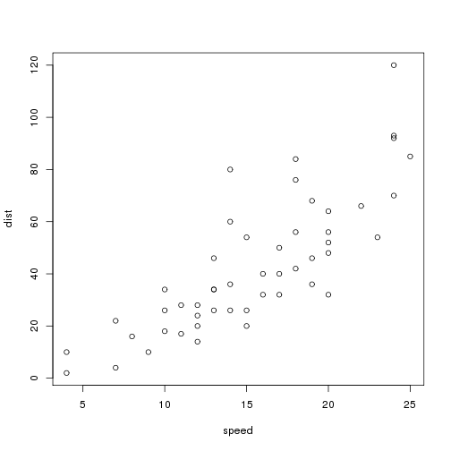
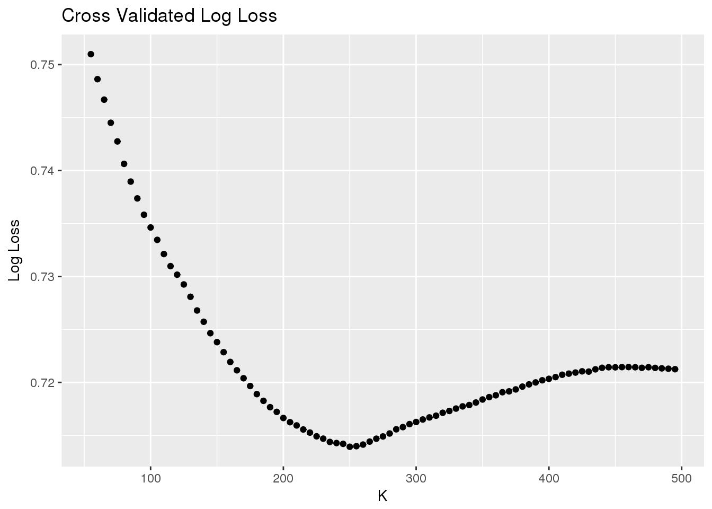

Predicting Kobe Bryant's Field Goals
========================================================
author: Harrison Marick, Meredith Manley, Christien Wright
date: 12/11/17
autosize: true

Intro
========================================================

- Bullet 1
- Bullet 2
- Bullet 3

Exploratory Analysis 
========================================================

- Contributes towards variable selection

========================================================

Accuracy by Type of Shot
========================================================

Accuracy by Season
========================================================

Period Effect?
========================================================

K-NN
========================================================

Variables:
- Shot X
- Shot Y
- Season
- Period

***

